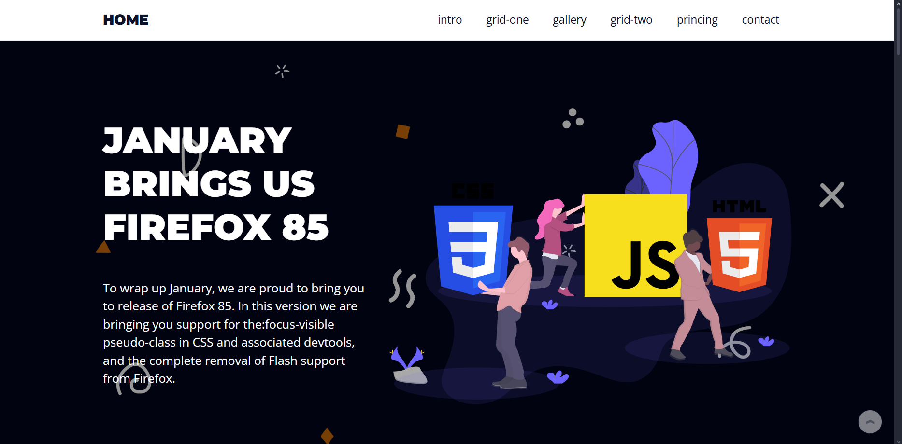

# 🚀 Landing Page

Este projeto é uma Landing Page responsiva desenvolvida com HTML, CSS e JavaScript. O objetivo é aprimorar as habilidades em desenvolvimento front-end, com foco em design moderno, responsividade e navegação fluida.

## 📸 Demonstração




## 🧰 Tecnologias Utilizadas

- HTML5  
- CSS3  
- JavaScript  

## 📁 Estrutura do Projeto
```
Landing-Page/
├── assets/
│ ├── css/
│ │ └── style.css
│ ├── js/
│ │ └── script.js
│ └── img/
│ └── [imagens da página]
├── index.html
└── README.md
```

## 🖥️ Visualização

Você pode visualizar a Landing Page ao vivo clicando no link abaixo:

🔗 [https://landing-page-kaua.netlify.app/](https://landing-page-kaua.netlify.app/)

## 📌 Funcionalidades

- Layout 100% responsivo  
- Design moderno e agradável  
- Scroll suave entre seções  
- Compatibilidade com os principais navegadores  

## 👨‍💻 Autor

Desenvolvido por **Kauã Vidal de Souza**  
Estudante de Ciência da Computação - UFPB (Campus IV)

- GitHub: [@Kaua-Vidal](https://github.com/Kaua-Vidal)
- Portfólio: [https://landing-page-kaua.netlify.app](https://landing-page-kaua.netlify.app)

## 📄 Licença

Este projeto está licenciado sob a Licença MIT.  
Consulte o arquivo `LICENSE` para mais informações.
